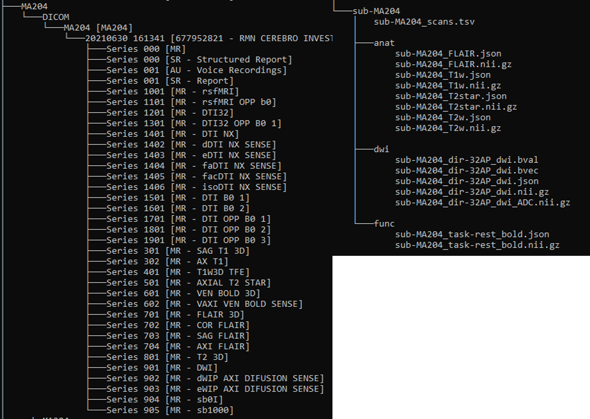
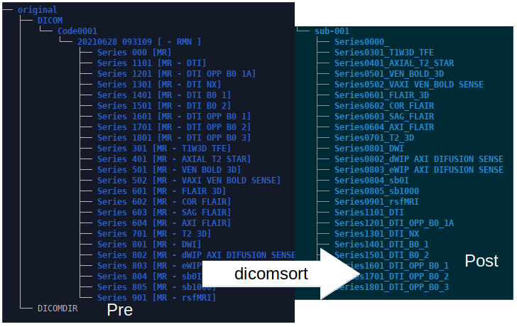
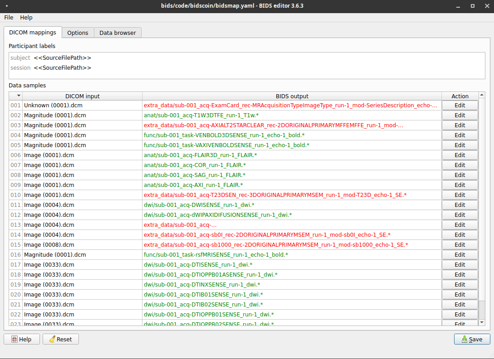
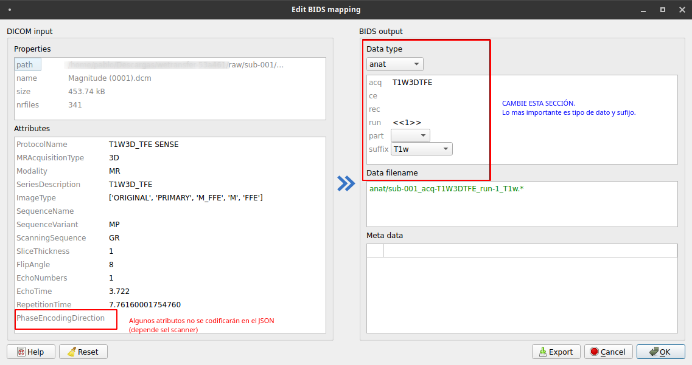

## BIDS conversion

Posterior a la anonimización es recomendable realizar una conversión a versiones NIFTI. Existen amplias herramientas para realizar esta conversión como dcm2nii, mricronGL, SPM entre otros que se vieron en el anterior apartado. Sin embargo, es recomendable utilizar el formato estándar [BIDS](https://bids.neuroimaging.io) que incluye no solo la conversión a formatos NIFTI sino una estructura estándar de etiquetación para los nombres de archivos.

[BIDS](https://bids.neuroimaging.io) Permite no solamente tener un orden en los archivos; al ser un sistema estandar existen diversas aplicaciones que se han desarrollado para formatos BIDS, por ejemplo, análisis de calidad, *deface*, estimación de grosor cortical, entre otros. Ahora bien, [BIDS](https://bids.neuroimaging.io) usa un sistema de subcarpetas sencillo: anat, func, dwi y otros, no es necesario que el estudio contenga secuencias para todas las carpetas, pero esta es la estructura básica. Otro elemento interesante es que [BIDS](https://bids.neuroimaging.io) se encuentra en actual expansión y a futuro se desea incluir otro tipo de información como EEG, rastreo ocular y otros datos fisiológicos.

La conversión a formatos BIDS requiere la elaboración de una plantilla inicial que se aplicará a todos los estudios. Existen pocos programas que tengan interfaz gráfica para la conversión BIDS. [BIDScoin](https://bidscoin.readthedocs.io/en/stable/) es una herramienta en python que presenta algunas intefaces gráficas que permiten un manejo ágil.

Toda la información sobre la instalación y uso se puede encontrar en la siguiente página.
[https://bidscoin.readthedocs.io/en/stable/](https://bidscoin.readthedocs.io/en/stable/)

Para el siguiente tutorial se ejemplificará el uso de BIDScoin
En la figura se ilustra un ejemplo de un archivo DICOM a un archivo BIDS



Existen tres momentos para la conversión de dicom a BIDS
1. Instalación de paquetes (se realiza una única vez).
2. Creación de plantilla (se realiza una única vez).
3. Conversión (puede ser por sujeto o masivamente).

Los dos primeros pasos pueden ser algo engorrosos y requieren de paciencia (le recomiendo ver el video explicativo). La ventaja es que una vez hecho esto, podrá realizar conversiones masivamente sin preocuparse por posibles errores. 

### Requisitos (en windows)

- ANACONDA
  - BIDScoin
  - dcm2niix
  - dicomsort (instalado con BIDScoin)
  - dicomsorter (en caso de fallos con disomsort)

### Pasos

- Instalación de librerías

En windows por medio de la consola de ANACONDA (powershell prompt).
Es recomendable crear un ambiente (enviroment) independiente para correr el convertidor bidscoin. Para bidscoin versión 3.7.0 se requiere usar python 3.8 en adelante. 

```console
pip install dicomsorter
pip install bidscoin
conda install -c conda-forge dcm2niix
```

### Requisitos (Linux)

* dcm2niix

* dicomsorter

En linux

```console
## pip install dicomsort
pip install bidscoin
apt install dcm2niix
```

- Genere dos folders uno para las imágenes RAW y otro para las imágenes BIDS.
- Descomprimir archivos tar.gz o ZIP en el folder RAW. Dependerá del sistema de compresión que se use para compartir el participante.
- Organizar folders en versión serie/folder

```console
dicomsort [folder de sujeto]
## Example
dicomsort original
## los archivos ordenados quedaran dentro de la misma carpeta de entrada
```

---

Dicomsort requiere pydicom por encima de la versión 2. En Linux pueden ocurrir errores por la versión de pydicom. Si estos errores persisten use dicomsorter que es un paquete similar y mucho mas robusto. Dicomsorter no hace parte de las librerías instaladas por BIDScoin y por ello se debe instalar. Otros errrores pueden estar relacionados con la instalación de QT5, verifique que se encuentra instalado QT5.

```console
pip install dicomsorter
dicomsorter [folderin] [foldersalida]
## Example
mkdir sub-001
dicomsorter original sub-001
## los archivos ordenados quedarán en sub001
```

---



- Si ha usado `dicomsort` se requiere renombrar la carpeta original con prefijo **sub-** y borrar el folder DICOM y DICOMDIR. Si ha usado `dicomsorter` el ordenamiento ha requerido un carpeta de salida.
- Para que `bidscoin` funcione sobre la carpeta raw, ésta debe contener al menos una subcarpeta que comience con **sub-** sino se haya una subcarpeta **sub-xxx** el sistema parará. En formatos **BIDS** los sujetos comienzan siempre con el prefijo **sub-**. Este paso se requiere para todos los casos.
- El siguiente paso solo requiere ser hecho una vez y es la generación del archivo yaml que será el template para todo el proyecto. Solo si se cambian los valores de adquisición i.e el nombre de secuencia de T1TFE a T13dTFE se deberá cambiar este archivo yaml. Para poder hacer un archivo template se requiere usar `bisdmapper`, el cual a partir del archivo dicom buscará los nombres de las series y les asignará un nuevo nombre en formato BIDS. Guarde el archivo en la carpeta BIDS.

```console
bidsmapper [folder raw de sujetos] [folder BIDS]
## example
bidsmapper raw BIDS
```

El resultado es un archivo yaml que si bien podría editarlo con un notepad, lo recomendable es usar el aplicativo `BIDSeditor`

- Con el archivo YAML creado es posible editarlo con `bidseditor` para adaptarlo al sitio del proyecto o institución. Tenga en cuenta que este archivo YAML solo servirá para su institución.
- Editar el archivo YAML para renombrar y organizar los archivos que requiere su proyecto.
  - Inicie `bidseditor` para cambiar las especificaciones de YAML

```console
bidseditor -b bidsmap.yaml [bidsfolder]
## Example:
bidseditor -b BIDS\code\bidscoin\bidsmap.yaml bids
```



- En la sección de *action* edite los archivos que requiere para su investigación, recuerde que BIDS requiere que las secuencias estructurales queden en un folder *anat*, las funcionales en *func* y las de difusión en *dwi*. Puede consultar el estándar en la página principal de [BIDS](https://bids-specification.readthedocs.io/en/v1.6.0/).
- En verde es posible que el sistema reconozca algunos archivos y los intente renombrar; sin embargo, revise qué tipo de archivos requiere usted para su investigación. Los archivos que no necesite, serán almacenados en una subcarpeta denominada `extra_data`.



- Con el editor usted podrá, determinar las características básicas del nombre del archivo. Los mínimos requisitos son el tipo de dato y el sufijo. El resto de variables son opcionales. Guarde nuevamente o sobreescriba el archivo YAML.
- Finalmente el paso que viene es la conversión dicom a nifti para ello puede usar el comando `bidscoiner`. Si observa que no hay conversión, revise nuevamente el archivos yaml con bidseditor y modifique en opciones la sección "module add dcm2niix" a "dcm2niix".
- El sistema Bidscoin funciona directamente sobre la carpeta raw en la que se encuentran los sujetos. Dado que los sujetos se identifican son sub-XXX, usted debe introducir el código de cada uno y el sistema convertirá automáticamente los sujetos. Recuerde que no debería cambiar los parámetros de adquisición de las imágenes.

```console
bidscoiner [sujeto] [archivo yaml] [forlder de sujetos] [folder BIDS]
## Example
bidscoiner -p sub-001 -b bids/code/bidscoin/bidsmap.yaml raw/ bids/
```

Una vez que haya realizado la primera conversión, verifique con [BIDSvalidator](https://bids-standard.github.io/bids-validator/) que se cumplen los requisitos del formato. Si tiene errores graves, modifique nuevamente el archivo YAML. Si no requiere archivos del extra_data puede borrarlos, pero conserve igualmente una copia original.

***Videotutorial***

<!-- blank line -->

<figure class="video_container">
  <iframe src="https://www.youtube.com/embed/ze9vibDPYyQ" width="100%" height="310" frameborder="0" allowfullscreen="true"> </iframe>
</figure>
<!-- blank line -->
