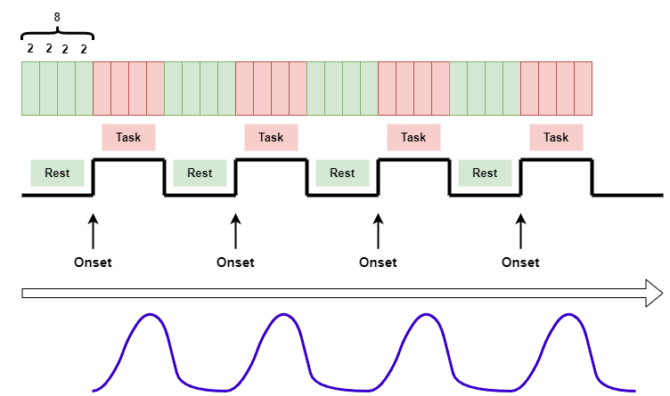
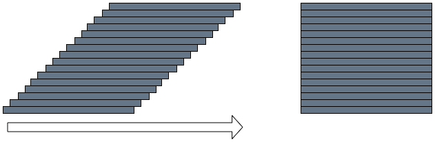
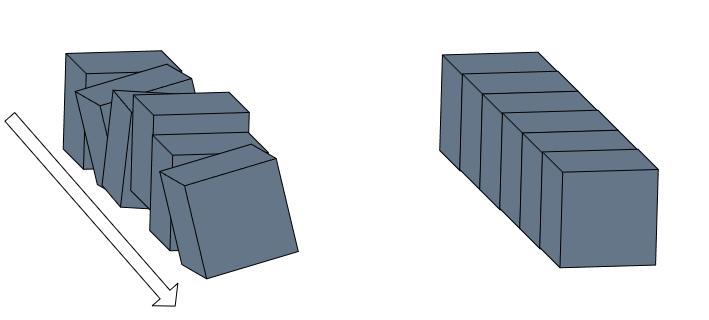
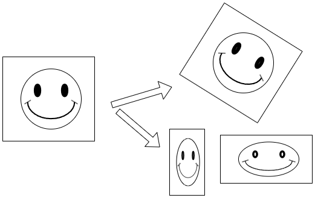

# Resonancia magnética funcionales

Una tarea o paradigma de resonancia funcional es un procedimiento experimental diseñado para evaluar la actividad neuronal en regiones específicas del cerebro mediante la utilización de imágenes de resonancia magnética funcional (fMRI).

Durante la tarea, los participantes se les pide que realicen una tarea específica, como ver imágenes, escuchar sonidos, leer palabras, etc. Mientras realizan la tarea, se registran los cambios en la actividad cerebral mediante la fMRI.

La tarea se suele diseñar para evaluar una hipótesis específica sobre el funcionamiento cerebral, como la activación de ciertas regiones del cerebro durante la ejecución de una tarea cognitiva o la modulación de la actividad cerebral por un determinado factor experimental.

La fMRI es una técnica no invasiva que utiliza la señal de oxígeno en la sangre para medir la actividad neuronal en el cerebro. La tarea o paradigma de resonancia funcional es una herramienta importante para la investigación en neurociencia cognitiva, psicología y psiquiatría, ya que permite explorar la relación entre la actividad cerebral y la cognición, la emoción, el comportamiento y los trastornos mentales.

## Tareas o paradigmas

En En la resonancia magnética funcional (fMRI), existen dos tipos de paradigmas principales: los paradigmas de bloque y los paradigmas de evento.

Los paradigmas de bloque implican la presentación de un estímulo o tarea durante períodos continuos de tiempo (por ejemplo, 20 segundos), seguido de otro estímulo o tarea durante otro período de tiempo continuo (por ejemplo, 20 segundos). Este patrón se repite varias veces durante la duración del experimento, lo que permite obtener una respuesta promedio de la actividad cerebral durante la tarea.

Los paradigmas de evento implican la presentación de estímulos o tareas durante períodos cortos e intermitentes (por ejemplo, 2-5 segundos) con un intervalo de tiempo variable entre ellos. Cada evento se considera un estímulo separado, lo que permite obtener una respuesta de la actividad cerebral relacionada con cada evento individual.

La elección del paradigma depende del fenómeno que se esté estudiando. Los paradigmas de bloque se utilizan comúnmente para estudiar procesos cognitivos complejos, como la memoria o el procesamiento de lenguaje. Los paradigmas de evento se utilizan a menudo para estudiar procesos sensoriales o motores simples. Ambos paradigmas son herramientas valiosas para estudiar la actividad cerebral relacionada con una tarea específica y se utilizan ampliamente en la investigación en neurociencia cognitiva, psicología y psiquiatría.

## Análisis funcionales con fsl

Existen varios software para realizar análisis de neuroimágenes funcionales. Para esta sección hablaré de FSL. Este es un paquete multipropósito; es decir, realiza análisis funcionales también puede realizar otro tipo de análisis como la morfometría basada en voxeles, tractografía, segmentación entre otros.

## Insalación de fsl
FSL tiene una gran ventaja y es su documentación. Allí va a enocntrar todo lo necesario para instalar este programa en sus sitema operativo. Como siempre suelo recomendar prefiero Linux y la versión de Ubuntu. FSL no corre en versiones como Arch ni en versiones como POP!. [Instalación de FSL](https://fsl.fmrib.ox.ac.uk/fsl/fslwiki/FslInstallation). Le recomiendo que realice todos los pasos que se incluyen en el manual hasta la configuración del shell.

## Etapas del Procesamiento
1. Conversión de formatos de archivo: el primer paso es convertir los archivos de imagen de fMRI desde su formato original, como DICOM, al formato de la librería FSL, que es NIfTI.

2. Eliminación de los primeros volúmenes (optativo): los primeros volúmenes de una secuencia fMRI pueden contener artefactos y no ser representativos de la actividad cerebral estable. Por lo tanto, se eliminan de la secuencia para reducir el efecto de los artefactos en el análisis.

3. Corrección de movimiento: los sujetos pueden moverse durante la adquisición de fMRI, lo que introduce artefactos de movimiento en las imágenes. Para corregir esto, se realiza la alineación de todos los volúmenes de la secuencia a un volumen de referencia.

4. Eliminación de ruido: se aplican técnicas de filtrado temporal, como la regresión de los efectos de la señal de los movimientos o la eliminación de las señales de los ventrículos cerebrales y otros tejidos blandos, para eliminar artefactos de ruido de la secuencia de fMRI.

5. Suavizado espacial: se aplica un filtro de suavizado espacial, como la convolución con un núcleo gaussiano, para mejorar la relación señal-ruido de la imagen.

6. Normalización espacial: se aplica una transformación espacial para normalizar las imágenes de fMRI a un espacio estándar, como el espacio de referencia del Montreal Neurological Institute (MNI).

7. Segmentación estructural: se utiliza la imagen estructural T1 de cada sujeto para segmentar las diferentes estructuras cerebrales y crear una máscara de materia gris para su posterior análisis.

8. Creación de modelos de diseño: se crea un modelo de diseño que describe la estructura de los eventos o bloques experimentales que se analizarán.

9. Análisis de la señal: se realiza el análisis estadístico de la señal de fMRI mediante técnicas como el análisis de la regresión lineal general (GLM) para determinar las áreas cerebrales activadas en respuesta a la tarea o estímulo experimental.

## Ejemplos

### Slice timing

### Realineación
El paso de realineación en neuroimágenes se refiere a un proceso de preprocesamiento que se realiza en imágenes de resonancia magnética funcional (fMRI) y en imágenes de tomografía por emisión de positrones (PET) para corregir los posibles movimientos que pueda haber realizado el sujeto durante la adquisición de la imagen.

Durante la adquisición de imágenes de fMRI y PET, es común que el sujeto se mueva ligeramente, lo que puede generar artefactos en la imagen y afectar la calidad y la interpretación de los resultados. Por lo tanto, la realineación es un paso crítico que se realiza para corregir estos movimientos.

El proceso de realineación consiste en alinear las imágenes de la secuencia adquirida en cada momento en el que se escanea al sujeto para crear una sola imagen promedio que represente la posición promedio del cerebro del sujeto en relación con el escáner. Para hacer esto, se utiliza un algoritmo de registro que compara cada imagen con la imagen de referencia y ajusta su posición para minimizar las diferencias de posición.

El algoritmo de registro es un conjunto de procedimientos matemáticos y computacionales utilizados para alinear dos o más imágenes que tienen diferencias en su posición, orientación o escala. El objetivo del registro es encontrar la transformación geométrica que mejor alinee las imágenes para que puedan ser superpuestas y comparadas.

El algoritmo de registro funciona al buscar la correspondencia entre características o puntos de referencia comunes en ambas imágenes, como bordes, esquinas o patrones de textura. Luego, se aplica una transformación geométrica a una de las imágenes para que se alinee con la otra. La transformación puede ser una rotación, traslación, escala o deformación no lineal, según las diferencias entre las imágenes.

El proceso de registro es iterativo y se realiza hasta que se alcanza una medida de similitud deseada entre las imágenes, que puede ser la superposición visual, la coincidencia de características específicas o la minimización de la diferencia entre las intensidades de los píxeles.

### Transformación
Las transformaciones lineales affine son aquellas que conservan las propiedades de la línea recta, como la paralelismo y la proporción de las distancias. Estas transformaciones son descritas por matrices lineales, que pueden incluir traslaciones, rotaciones, escalas y cortes.

Por otro lado, las transformaciones no lineales son aquellas que no se pueden describir mediante una matriz lineal. En otras palabras, estas transformaciones no conservan la estructura de la línea recta y pueden distorsionar la imagen. Algunos ejemplos de transformaciones no lineales son la distorsión de barril y la distorsión de almohadilla.

La principal diferencia entre las transformaciones lineales affine y las no lineales es que las primeras mantienen la estructura lineal de la imagen, mientras que las segundas pueden deformarla. Además, las transformaciones lineales affine pueden ser descritas de manera precisa mediante una matriz lineal, mientras que las transformaciones no lineales requieren una descripción más compleja, como una función no lineal.

## Videotutorial

**En construcción**
