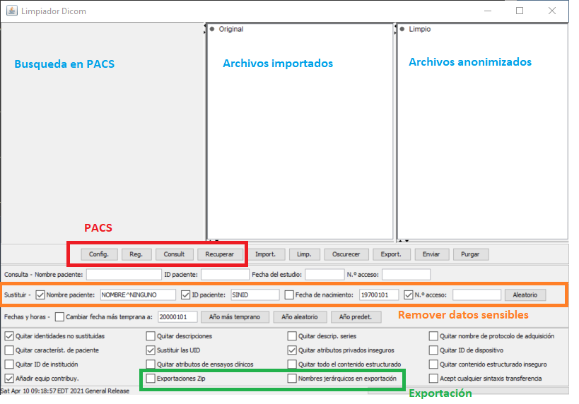

# ## Importación DICOM y anonimización

Para anonimizar archivos dicom es recomendable usar [Dicomcleaner de pixelmed](http://www.dclunie.com/pixelmed/software/webstart/DicomCleanerUsage.html). Se puede usar en cualquier sistema operativo y tiene interfaz gráfica. Por otra parte dicomcleaner permite importar archivos desde un CD y desde el servidor PACS que aloja las imágenes dicom en una institución.



### Desde el PACS

Los datos de configuración deben ser introducidos por el personal de tecnología de la institución o del propio personal que administra el PACS.

Pasos para anonimizar

- Usar [Dicomcleaner de pixelmed](http://www.dclunie.com/pixelmed/software/webstart/DicomCleanerUsage.html)
- Conectarse al PACS (servidor)
- Buscar por ID comenzando con *
- Realizar Query (Consultar)
- Darle a Retrieve (Recuperar)
- Hacer Clean (Limpiar) - Revisar opciones de anonimización
- Export (Exportar):
  - Anonimizado para investigación

### Desde DVD CD USB

Pasos para anonimizar

- Usar [Dicomcleaner de pixelmed](http://www.dclunie.com/pixelmed/software/webstart/DicomCleanerUsage.html)
- Insertar DVD o CD
- Importar carpeta (import)
- Hacer limpieza y anonimización (Clean)
  - Revisar opciones de anonimización como "accession number"
- Exportar (Export):
  - Anonimizado para investigación

### Intercambio de imágenes dicom

Es recomendable que para el intercambio de imágenes se usen formatos comprimidos como ZIP o tar.gz. Subir archivos por ejemplo a un servicio de nube sin su compresión puede incrementar las probabilidades de errores dado que generalmente las neuroimágenes producen miles de archivos y la falta de uno de ellos puede corromper la visualización o conversión a otros formatos.

***Videotutorial***

En el siguiente [video tutorial](https://youtu.be/sTndWTDefVw) se muestran elmentos que explican los anteriores pasos.

<!-- blank line -->

<figure class="video_container">
  <iframe src="https://www.youtube.com/embed/sTndWTDefVw" width="100%" height="310" frameborder="0" allowfullscreen="true"> </iframe>
</figure>
<!-- blank line -->

* * *


## Deface

Un segundo paso de anonimización es el deface o eliminación del rostro. Dado que es posible reconstuir una imágen en tercera dimensión a partir de las resonancias estructurales, es viable reconstruir la cara de una persona y por ende identificarla publicamente. Esto atentaría contra el principio de anonimato en las investigaciones clínicas. De esta manera hoy en día se procede a realizar la eliminación del rostro por medio de software.

Una herramienta sencilla y eficiente es pydeface

```bash
pip install pydeface
```

Una vez se tiene instalada se puede correr bien sea serial o paralelamente. Utilice la versión serial si debe realizar el procedimiento un gran número de veces.

```bash
pydeface t1.nii.gz
```

Resultado


Para hacer defacing en paralelo puede bajar el script siguiente:

[defaceparallel.sh](https://github.com/pabloreyesg/Scrips-to-MRI/blob/master/defaceparallel.sh)
