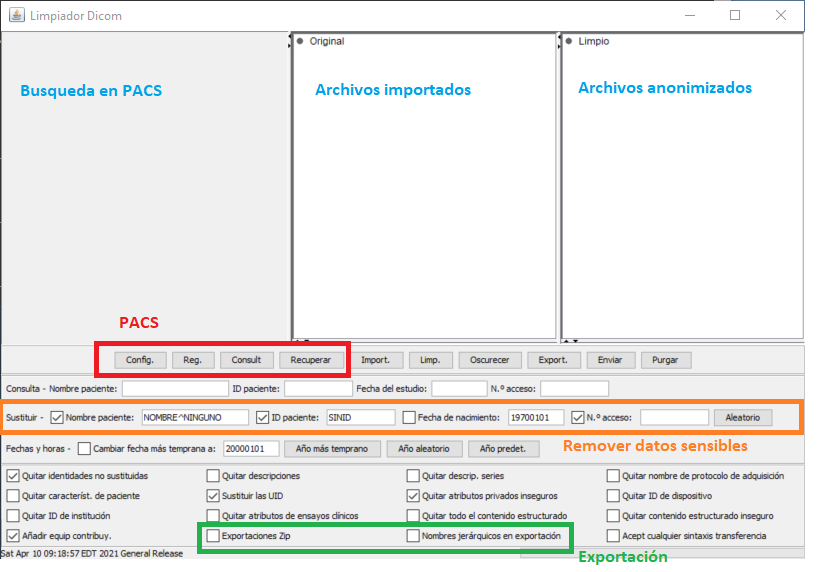

# Gestión de neuroimágenes DICOM

## Importación DICOM y anonimización
Para anonimizar archivos dicom es recomendable usar [Dicomcleaner de pixelmed](http://www.dclunie.com/pixelmed/software/webstart/DicomCleanerUsage.html). Se puede usar en cualquier sistema operativo y tiene interfaz gráfica. Por otra parte dicomcleaner permite importar archivos desde un CD y desde el servidor PACS que aloja las imágenes dicom en una institución.

### Desde el PACS
Pasos para anonimizar

- Usar [Dicomcleaner de pixelmed](http://www.dclunie.com/pixelmed/software/webstart/DicomCleanerUsage.html)
- Conectarse al PACS (servidor)
- Buscar por ID comenzando con *
- Realizar Query (Consultar)
- Darle a Retrieve (Recuperar)
- Hacer Clean (Limpiar) - Checar opciones de anonimización
- Export (Exportar): 
	- Anonimizado para investigación

### Desde DVD CD USB
Pasos para anonimizar

- Usar [Dicomcleaner de pixelmed](http://www.dclunie.com/pixelmed/software/webstart/DicomCleanerUsage.html)
- Insertar DVD o CD
- Importar carpeta (import)
- Hacer limpieza y anonimización (Clean) 
	- Revisar opciones de anonimización como "accession number"
- Exportar (Export): 
	- Anonimizado para investigación

### Intercambio de imágenes dicom
Es recomendable que para el intercambio de imágenes se usen formatos comprimidos como ZIP o tar.gz. Subir archivos por ejemplo a un servicio de nube sin su compresión puede incrementar las probabilidades de errores dado que generalmente las neuroimágenes producen miles de archivos y la falta de uno de ellos puede corromper la visualización o conversión a otros formatos.

***Videotutorial***

En el siguiente video tutorial se muestran elmentos que explican los anteriores pasos.

* * *
