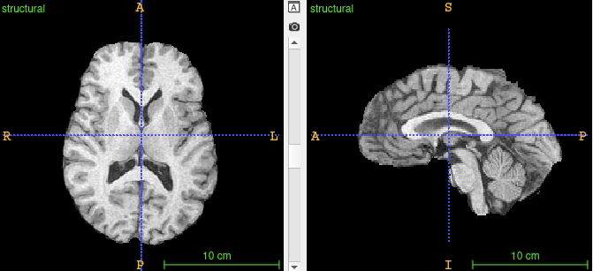
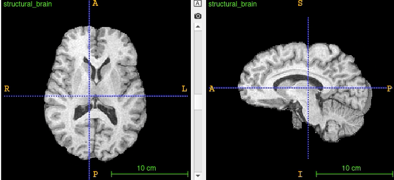

# Preprocesamiento inicial

Posterior a la conversión en algunos casos se requieren cambios adicionales que trataremos en este apartado y que son:

- Orientación estándar de las neuroimágenes.
- Remuestreo.
- Corrección por alteraciones de la homogeneidad del campo.

## Cambiar orientación

La orientación en neuroimágenes tiene se llama RPI radiológica, y LPI neurológica

- Right - Posterior - Inferior RPI : "Las imágenes se ven como si miraran hacia arriba desde los pies del sujeto".
- Left - Posterior - Inferior LPI : "Las imágenes se ven como si se mirara desde la parte superior de la cabeza hacia abajo".

Con FSL se puede usar el siguiente script para reorientar todas las imágenes dentro de una carpeta.

```
for f in *; do fslreorient2std $f r$f ; done
```

## Cambiar el tamaño del voxel

Las neuroimágenes ocasionalmente requieren ser transformadas; es decir, cambiar el tamaño del voxel de 0.5mm a 1mm; en este punto hay que tener en cuenta que la transformación requiere un proceso adicional que es la interpolación. FSL ofrece varios tipos de interpolación mi recomendada es **nearestneighbour** dado que preserva la mayor cantidad de información posible y no introduce el suavizado típico de convoluciones gaussianas.

Con el siguiente script usted podrá remuestrear todas las imágenes de una carpeta al tamaño deseado en este caso usaremos 1, que alude a voxeles isométricos de 1mm. En este caso los archivos de salida tendran como prefijo `r`  .

Ahora bien, tenga en cuenta que es mejor pasar de una resolución alta a una baja. En caso contrario es mejor usar algoritmos de superresolucion.

```
for f in *; do flirt -in $f -ref $f -out r$f -applyisoxfm 1 -interp nearestneighbour; done
```

## N4Bias

Durante la adquisición es frecuente encontrar algunos artefactos en la imagen, es posible corregir algunos de estos y otros no tanto. Un artefacto que puede ser corregible es el dado por la falta de homogeneidad "low frequency intensity non-uniformity".  La mejor forma de corregir esta alteración es por medio d el librería ANTs y el script N4BiasFieldCorrection.

El algoritmo N4Bias utiliza una técnica de estimación de campo de intensidad no uniforme basada en el espacio de frecuencia, para modelar y corregir la variación no uniforme de la intensidad en las imágenes de MRI. El algoritmo se basa en la suposición de que la imagen es una combinación de una imagen verdadera y un campo de intensidad no uniforme. El algoritmo utiliza esta suposición para calcular y corregir el campo de intensidad no uniforme.

```
for f in *; do N4BiasFieldCorrection -d 3 -i $f -o n$f -v; done
```

## Extracción de craneo
Las imágenes estructurales tomadas en T1 y T2, requieren como etapa previa al procesamiento la extracción del cráneo. Este paso es útil para posteriores estapas como la normalización y el registro. Una de las herramientas con mayor historia es BET de FSL.

**Resultado**



***Videotutorial sobre el uso de BET***

<!-- blank line -->

<figure class="video_container">
  <iframe src="https://www.youtube.com/embed/IZN_8TpVgqo" width="100%" height="310" frameborder="0" allowfullscreen="true"> </iframe>
</figure>

<!-- blank line -->

## Registro y normalización
En el contexto de imágenes médicas, el registro y la transformación de imágenes son procesos importantes para la comparación y fusión de imágenes adquiridas en diferentes momentos, desde diferentes modalidades, o desde diferentes pacientes.

El registro de imágenes médicas se refiere al proceso de alinear y ajustar dos o más imágenes médicas de la misma anatomía o estructura, para que puedan ser comparadas o fusionadas. Esto es especialmente útil cuando se tiene imágenes adquiridas en diferentes momentos o desde diferentes modalidades, lo que puede hacer que las imágenes no se alineen exactamente.

El registro de imágenes médicas puede ayudar en la detección de cambios en la anatomía de un paciente a lo largo del tiempo, en la integración de información de diferentes modalidades de imágenes médicas, como la combinación de imágenes de resonancia magnética (RM) y tomografía por emisión de positrones (PET), y en la planificación de tratamientos quirúrgicos o radioterapéuticos.

Por otro lado, la transformación de imágenes médicas se refiere a la aplicación de una transformación geométrica a una imagen médica para corregir errores de adquisición, mejorar la resolución espacial, ajustar el tamaño y la forma de la imagen, o para alinear la imagen con otras imágenes para su comparación o fusión. Estas transformaciones pueden ser lineales o no lineales, dependiendo de la complejidad del cambio requerido en la imagen. Las transformaciones son un elemento esencial para el siguiente paso que es la normalización

Normalizar puede ser definida como transformar el espacio geométrico de una imagen y llevarla a otro espacio geométrico. Existen dos escenarios en los que se requiere un registro: cuando un participante se le toman varias imágenes en el tiempo y se quiere visualizar las diferencias será necesario tener un proceso de registro entre estos tiempos; cuando se requiere normalizar la imagen de un participante hacia una plantilla o template estandard como el MNI.

**Resultado**



***Videotutorial sobre el uso de FLIRT***

<figure class="video_container">
  <iframe src="https://www.youtube.com/embed/LsYxcAbG2Ok" width="100%" height="310" frameborder="0" allowfullscreen="true"> </iframe>
</figure>
<!-- blank line -->
